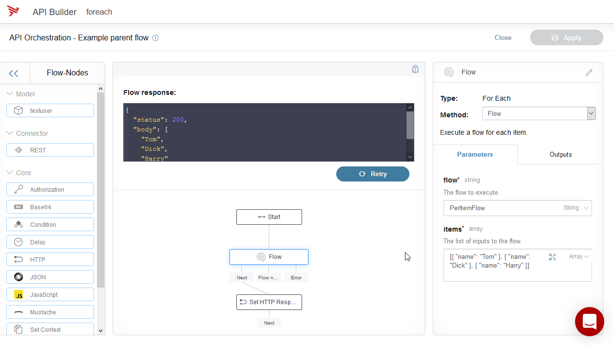
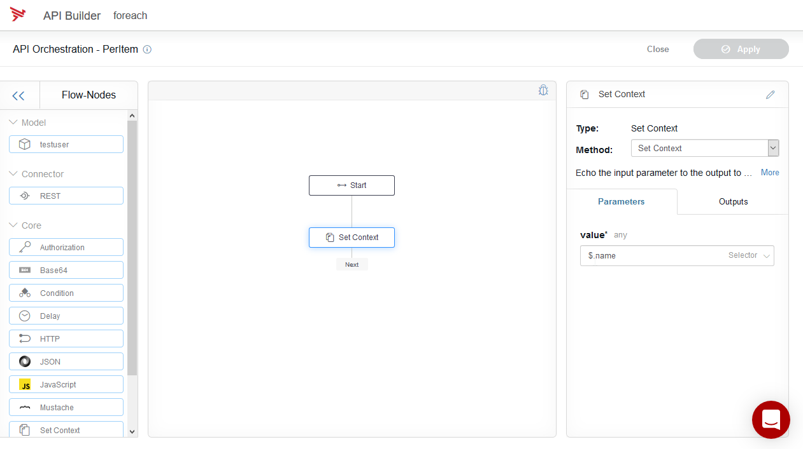

[](https://github.com/Axway-API-Builder-Ext/api-builder-extras/actions?query=XML+Flow)

This node is like an Array.forEach(). It iterates over the array invoking a flow for each element.

## Creating the nested flow
:point_up:  
One of the unsupported features is to create a flow that isn't bound to an API endpoint.  
That means, there's actually no UI for doing this.  
However, you can manually create nested flows as you want in the `/flows` diretory of your API-Builder project and call them with the For-Each flownode this project provides.  

To streamline the process for you, we have installed two sample flows during installation of the plugin into your `flows` directory.
- `/flows/ExampleParentFlow.json`
- `/flows/PerItemFlow.json`

_Consider both flows as examples. You can create your own flows, just by copy the existing ones and rename them them._

### Main flow
The main flow is typically a normal flow you have created using the API-Builder and attached to an API-Endpoint.  
The sample Main-Flow is supposed just to give you an example how a to call a Nested-Flow as shown in the following screenshot:    
  
If you would like to open the sample main flow in your API-Builder flow editor to see how it is working, use the following URL:  
http://localhost:8080/console/project/flows/ExampleParentFlow/edit

### Nested flow
This is the nested flow (see below) that is called by the sample main flow. You can do whatever you need in that flow by using all installed API-Builder plugins.  
The result value of your nested flow is returned in `$.response`.  

You may create as many Nested-Flows as you want just by copy an existing flow in the `flows` directory, rename the file and configure the [expected parameters](#nested-flow-parameters) within the JSON-File.  
 

#### Sample nested flow
  
You may open nested-flows in the API-Builder editor just by using the following URL:   
http://localhost:8080/console/project/flows/PerItemFlow/edit  
_Obviously you can do the same with your own nested flows you have created. But please remember to restart the API-Builder process to make the flows available to the UI._ 

_Best is to open both flows (Main and Nested) in parallel in two Browser-Tabs at the same time to be able to modify both._

### Nested flow parameters
The nested flow is like a function and you need to tell the expected input parameters by using a Javascript object. The parameters given by the main flow have to pass schema validation in the nested flow.  
For example when iterating in the main flow over an array of objects `[ { name: 'Tom' }, { name: 'Dick' }, { name: 'Harry' }]`
the nested flow gets a single object: `{ name: 'Dick' }`, hence the parameter in the nested flow must be configured like so:   

```
	"parameter": {
		"properties": {
		    "name": { "type": "string" }
		},
		"additionalProperties": false,
		"required": []
	},
```
The `properties` field contains the expected object, which is in the example case an object having a field: `name` which must be of type `String`.

To pass the schema validation when calling the nested flow, the flow parameter: `items` has to be an Array, that contains the object as defined above. Configured like so:  
![Correct items parameter][items-parameter]  

:exclamation: Iterating over arrays of primitives (e.g. an Array of Strings) is not supported. Therefore, this example wont work:   
![Wrong items parameter][wrong-items-parameter]  

In the example above, the flow will execute 3 times, as the array had 3 elements.
`$.name` will be the `Tom` on the first, `Dick` on the second, and `Harry` on the third.


## Flow

The _Flow_ method iterates over an array of objects and invokes the specified flow with the object as the input.

| Param | Type | Required | Description |
| --- | --- | --- | --- |
| flow | string | y | The flow id of the flow to execute. Filename of the flow without .json |
| items | array | y | The array to iterate over. The array must contain objects that fit the desclared parameters in the nested flow |

## Install

After creating your API Builder service (`api-builder init`), you can install this plugin using npm:

```
npm install --no-optional @axway-api-builder-ext/api-builder-plugin-fn-foreach
```

## Changelog
See [Change-Log][6]

[6]: Changelog.md

[flow-editor]: imgs/foreachFlow.png
[items-parameter]: imgs/items_parameter.png
[wrong-items-parameter]: imgs/wrong_items_parameter.png
[example-parent-flow]: imgs/ExampleParentFlow.png
[example-nested-flow]: imgs/ExampleNestedFlow.png
